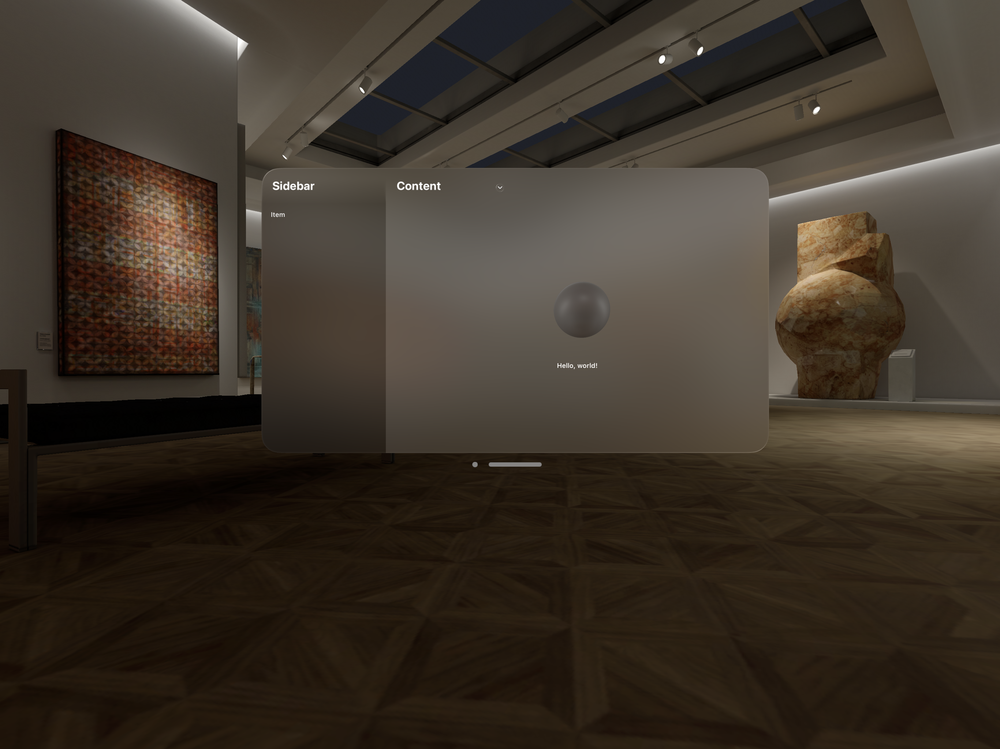

## 🐶 创建您的第一个visionOS APP

1、打开您安装好的Xcode_15_beta_3，创建一个新的项目。

2、选择visionOS的APP。

3、选择初始化场景Window

4、打开ContentView,即可预览到新创建到Hello World！

5、最后启动模拟器，即可看到最后模拟器中您到应用到效果！

## 🎉恭喜您，此刻您的visionOS第一个APP已经被你开发出来了！您可以在这个模拟器中体验visionOS的各种功能。
同时还可以看到您开发的APP在visionOS中的效果。快来一起感受未来的APP吧！
