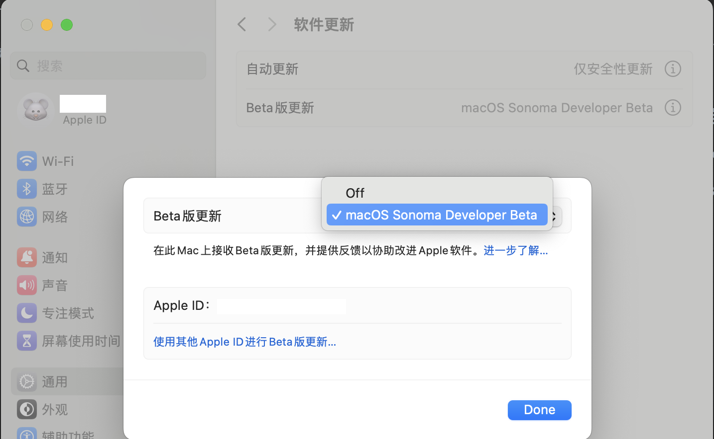
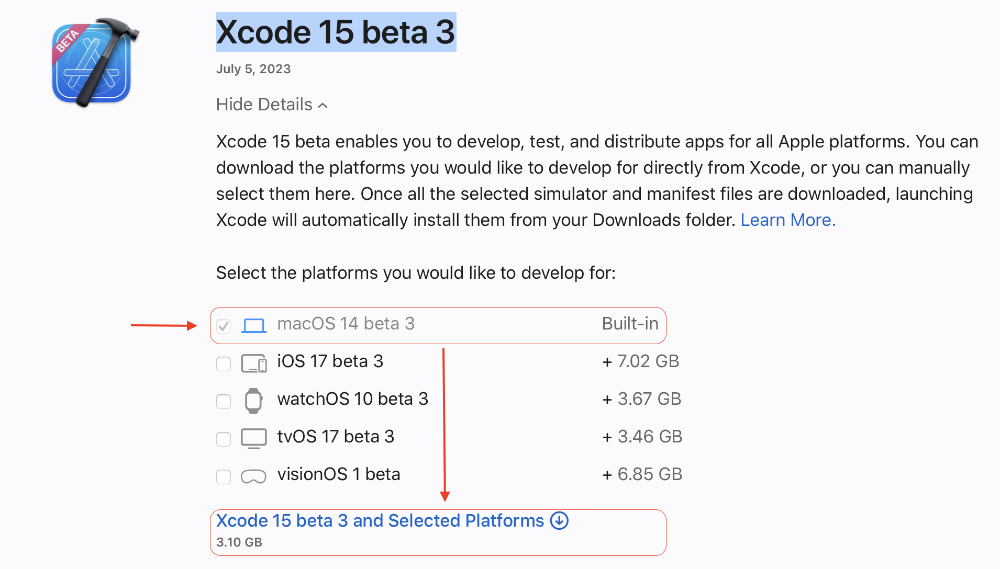
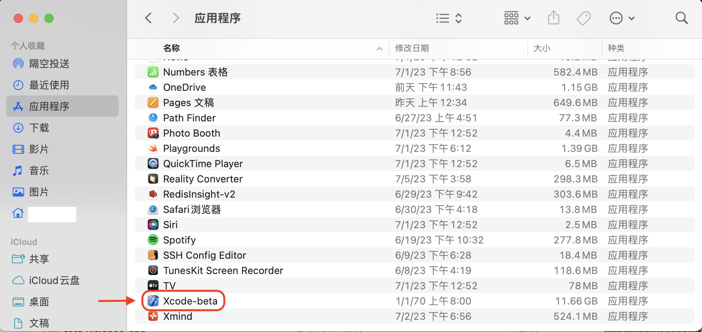
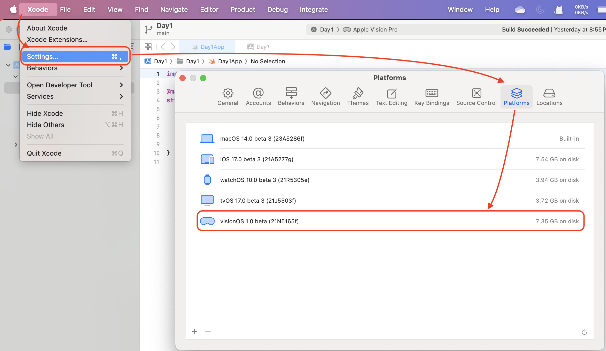

# visionOS_app_dev_study
visionOS app dev study. Maybe VisionOS is the future! So I wan't catch it! Show my visionOS app dev study experience.

visionOS应用开发学习。也许VisionOS就是未来！所以我想要抓到它！展示我的visionOS应用开发学习经验。

## 🐶 新手必读
### 一、首先需要搭建自己的visionOS开发环境：
1、首先您需要又一个Mac系统到开发设备，因为需要升级到最新的系统，所以设备不能太老旧。

2、将您到Mac系统打开Beta版本更新，并更新到最新到macOS Sonoma Developer Beta版本。

3、从官网下载最新的Beta版本的[Xcode 15 beta 3](https://developer.apple.com/download/all/?q=Xcode),只需要选择对应的Xcode5即可。

4、下载下来的安装文件为：Xcode_15_beta_3.xip，选择打开将解压出来的Xcode-beta应用拖拽到应用程序中即可。

5、打开Xcode-beta如果没有自动提示下载安装visionOS模拟器，则在打开Xcode-beta应用后，进行visionOS模拟器的下载。

## 🎉恭喜您，此刻你的visionOS开发环境已经搭建完成！